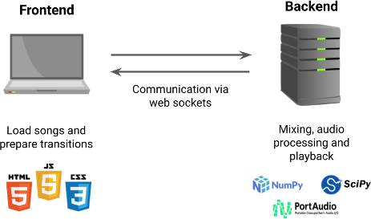
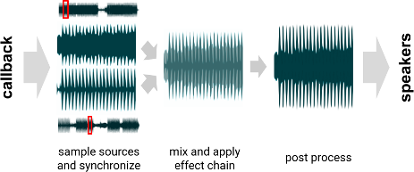

# AutoDJ - A DJ software written in Python

AutoDJ is a DJ software that allows users to play music and easily create impressive transitions between songs in real-time. I have worked on this project for the last couple of months and it is my first contact with digital signal processing :)

## Features

- Real-time mixing and control
- Web-based user interface
- Automated track synchronization (BPM and offset detection)
- Programmable transitions
- Various effects (reverb, delay, high- and lowpass, volume, noise)

## Demo

TODO: Add YouTube video

## Repository Structure

* [Frontend (web)](/autodj/frontend)
* [Backend (Python)](/autodj/backend)
* [Songs folder (.mp3, .mp4, .wav)](/autodj/data/songs)

## Design



The front end provides the interface to control the mixer and to set up transitions visually. The backend handles all the heavy work such as mixing and providing the webserver. Both components communicate using [Socket.IO](https://socket.io/) and [python-socketio](https://pypi.org/project/python-socketio/), which allows for low latency communication over web sockets. The frontend is mostly written in plain JS, HTML, and CSS, as well as SVG for the transition control component. The backend is written in Python and heavily relies on numerical libraries such as [NumPy](https://numpy.org/) and [SciPy's signal processing library](https://docs.scipy.org/doc/scipy/reference/signal.html).

## Mixing

The backend is mainly responsible for mixing and thus constantly producing new blocks of audio samples that the audio driver can playback. The biggest challenge is to do this in real-time, meaning if we produce a block of 100ms, we can not take any longer than that without risking an underrun (that results in stuttering). The communication between Python and the audio driver is handled by [PyAudio](https://pypi.org/project/PyAudio/) which wraps the [PortAudio audio I/O library](http://www.portaudio.com/). 



In a first step, both sources are sampled, stretched, and synchronized. Stretching is necessary for both tracks to match the global BPM. However, changing the duration of a song without changing the pitch is very difficult and I instead rely on [pyrubberband](https://pypi.org/project/pyrubberband/) (a wrapper for the [Rubber Band Audio Time Stretcher Library](https://breakfastquay.com/rubberband/)).

For synchronization, the BPM and the offsets of both songs are determined when they are loaded. Machine learning approaches for BPM detection are provided in libraries such as [Essentia](https://essentia.upf.edu/reference/std_RhythmExtractor2013.html) and [librosa](https://librosa.org/doc/main/generated/librosa.beat.tempo.html) were either slow or had rather imprecise results (we need the exact BPM, otherwise the songs slowly drift apart). Instead, I developed a simple algorithm based on correlation on the spectrogram. This works great for heavily quantized music, e.g., pop and electronic music, but does not work for music that changes BPM over time.

Afterwards, the effects of the transition are applied, if active. The reverb is implemented as a [convolution reverb](https://www.bhphotovideo.com/find/newsLetter/Convolution-Reverb.jsp/). The highpass and lowpass are implemented using a Butterworth filter and are partially written in C since we need to change the cutoff dynamically and very efficiently (using precomputed tables), which SciPy does not provide.

## Transitions

Transitions are implemented as a function of effect parameters over time (a linear interpolation over the `[0, 1]` time axis). This allows adapting a transition to different durations. Currently, there is no visual editor yet, so all transitions are manually defined in JSON format. We only define the fade-in, since the fade-out transitions are automatically derived by simply mirroring the time axis. A simple fade could look as follows:

```js
{
  "name": "Simple",
  "fx": {
    "vol": [[0, 0], [1, 1]], /* Increase volume from 0% to 100% */
    "rev": [[0, 0], [0.5, 0.25], [1, 0]] /* Add slight reverb (25%) at middle of transition */
  }
}
```


## Issues

Some songs do not start on the strong downbeat of a measure and are therefore not correctly aligned to a measure (4 beats), e.g., when having some short intro. I have not found an efficient way to detect the offset in this case. Analyzing music is hard and if you have some ideas, let me know :)

## Installation

Tested with Python 3.6.9 and it should work for newer versions as well.

```shell
% Signal processing
pip install numpy 
pip install scipy
% Audio playback
pip install pyaudio
pip install pyrubberband
% API
pip install svgwrite
pip install eventlet
pip install socketio
```
